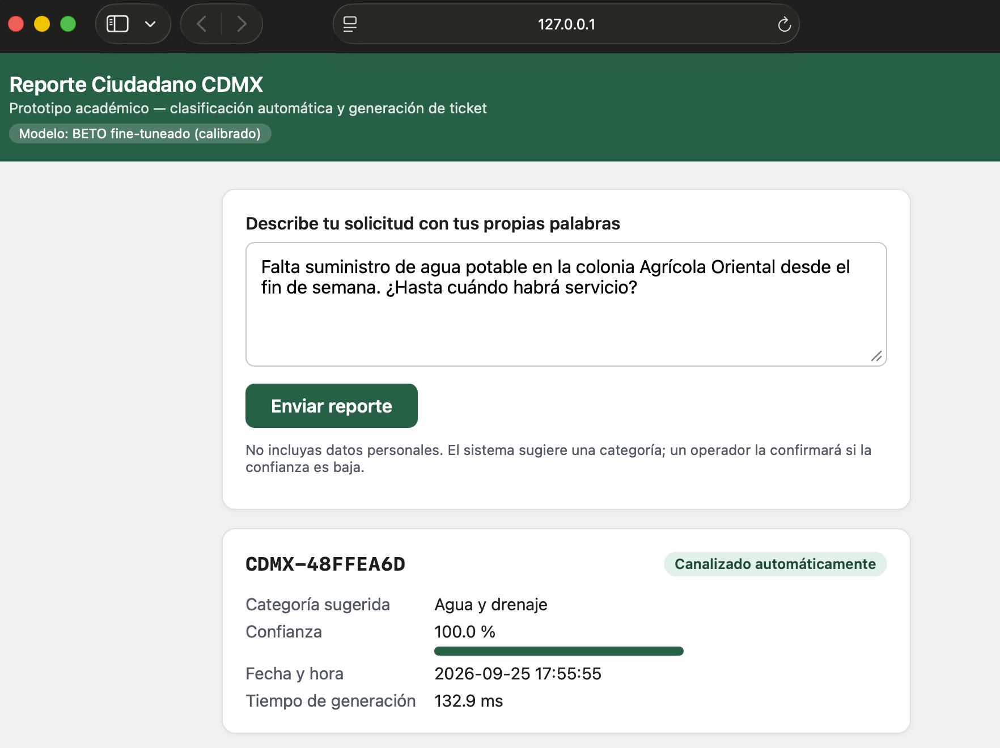
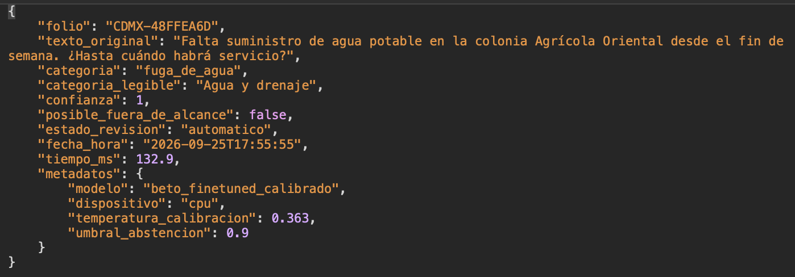

# Clasificador-de-solicitudes-ciudadanas-en-espa-ol

Prototipo de clasificación multiclase de solicitudes ciudadanas en español, con generación automática de tickets, desarrollado para la Ciudad de México (CDMX). Trabajo de innovación — UNIR, Maestría en Inteligencia Artificial.

**Equipo:** Edith Marcela Flores Urbieta (Scrum Master) · Ricardo Díaz Ochoa (Desarrollo) · Oscar Rodríguez Valentín (Product Owner)

> **Modelo adoptado:** BETO (fine-tuning) calibrado — F1 macro **0.919** sobre 282 solicitudes de prueba, frente a **0.872** del baseline TF-IDF + regresión logística.

> **Alcance:** el prototipo clasifica la solicitud y genera un ticket estructurado. No canaliza la solicitud hacia ninguna dependencia, no prioriza ni resuelve, y no sustituye a SUAC ni a LOCATEL. El folio que genera es técnico y no corresponde a un folio oficial.

## Tabla de contenido

- [Descripción](#descripción)
- [Documentos fuente](#documentos-fuente)
- [Construcción del corpus](#construcción-del-corpus)
- [Arquitectura](#arquitectura)
- [Resultados](#resultados)
- [Capturas de pantalla](#capturas-de-pantalla)
- [Cómo ejecutar el proyecto localmente](#cómo-ejecutar-el-proyecto-localmente)
- [Despliegue](#despliegue)
- [Mantenimiento y versiones](#mantenimiento-y-versiones)
- [Estructura del repositorio](#estructura-del-repositorio)
- [Limitaciones y trabajo futuro](#limitaciones-y-trabajo-futuro)

## Descripción

El proyecto clasifica solicitudes ciudadanas redactadas en texto libre en cinco categorías de servicio:

- 🕳️ Baches y pavimento
- 💡 Alumbrado público
- 🚰 Fuga de agua
- 🗑️ Recolección de basura
- 🚨 Seguridad

A partir de la categoría predicha y de su confianza calibrada, el sistema genera automáticamente un **ticket estructurado** (folio técnico, texto original, categoría, confianza, estado de revisión, fecha y hora, tiempo técnico y metadatos del modelo). Una regla de abstención marca para revisión humana los casos de baja confianza, y un detector auxiliar ("guardián") alerta sobre textos posiblemente fuera de las cinco categorías.

Se compararon dos enfoques sobre el mismo corpus y la misma partición de prueba:

| Enfoque | Descripción |
|---|---|
| **Baseline** | TF-IDF (1–2 gramas) + regresión logística con `class_weight` balanceado y calibración sigmoide |
| **BETO** | Fine-tuning de [`dccuchile/bert-base-spanish-wwm-cased`](https://huggingface.co/dccuchile/bert-base-spanish-wwm-cased) con pérdida ponderada por clase y calibración por temperatura (T = 0.363), entrenado en Google Colab con GPU |

El desarrollo se organizó con Design Thinking, Scrum y Lean: cuatro Sprints (del 10 de agosto al 30 de septiembre de 2026), 12 historias de usuario y 59 Story Points gestionados en Azure DevOps.

## Documentos fuente

### Documentación del proyecto

| Documento | Contenido |
|---|---|
| `PLAN_IMPLEMENTACION.md` | Diagnóstico inicial de los datos disponibles, estrategia de entorno (local vs. Google Colab) y plan de trabajo por Sprints. |
| `INSTALACION.md` | Guía de instalación paso a paso, solución al error `ModuleNotFoundError: sklearn.frozen` y tabla de dependencias por componente. |
| `GUIA_ANOTACION.md` | Guía de anotación: definición de las 5 categorías, casos límite y protocolo para el cálculo del Kappa de Cohen entre anotadores. |
| `BORRADOR_RESULTADOS.md` | Resultados: construcción del corpus, comparación de modelos, calibración y abstención, análisis de errores y conclusiones. |
| `Clasificador de Solicitudes CDMX Entrega 3.docx` | Documento formal del trabajo de innovación (entrega UNIR). |
| `README Exportador de Posts.txt` | Documentación del userscript usado para recopilar publicaciones de X. |

### Datos del corpus

| Archivo / carpeta | Contenido |
|---|---|
| `CORPUS/corpus_completo.csv` | Corpus consolidado y etiquetado (id, texto, categoría, método de etiquetado, entidad, alcaldía, fecha, fuente). |
| `CORPUS/train.csv`, `val.csv`, `test.csv` | Partición por grupos de plantilla, sin fuga de información entre conjuntos. |
| `CORPUS/excluidos_fuera_alcance.csv` | Textos fuera de las 5 categorías, usados para entrenar el detector auxiliar ("guardián"). |
| `CORPUS/muestra_control_anotacion.csv` | Muestra independiente de 67 registros para el cálculo del acuerdo entre anotadores (Kappa de Cohen). |
| `CORPUS/reporte_corpus.txt` | Reporte automático de construcción: conteos, deduplicación y distribución de clases. |
| `x_exportador_posts_comentado.js` | Userscript de recolección de publicaciones visibles en una sesión de X. |

## Construcción del corpus

Los portales gubernamentales y de datos abiertos de la CDMX se revisaron primero, pero no contenían descripciones textuales suficientes para la tarea. Se usaron para conocer los tipos de reporte más frecuentes y delimitar las cinco categorías; el texto ciudadano se obtuvo principalmente de publicaciones de X, recopiladas con un userscript que conserva el texto y la fecha, evita duplicados y exporta a CSV o TXT.

| Etapa | Registros |
|---|---|
| Registros recopilados | 10,791 |
| Tras la limpieza básica | 10,788 |
| Textos únicos tras la deduplicación | 3,352 |
| **Corpus final** (tras controles de plantillas y pertenencia a las categorías) | **1,884** |
| Excluidos por quedar fuera de las cinco categorías | 991 |

Distribución del corpus final: baches y pavimento 516 (27.4 %), alumbrado público 417 (22.1 %), fuga de agua 382 (20.3 %), seguridad 298 (15.8 %) y recolección de basura 271 (14.4 %).

Partición: **1,320** entrenamiento · **282** validación · **282** prueba. Los duplicados y las variantes de una misma plantilla se trataron antes de particionar, y el conjunto de prueba no se usó en ninguna etapa de entrenamiento ni de ajuste.

**Acuerdo entre anotadores:** sobre una muestra independiente de 67 registros (6 descartados por los evaluadores), el Kappa de Cohen fue **κ = 0.919** en 61 pares, con 93.44 % de acuerdo observado. Esta muestra no forma parte de las particiones del experimento.

## Arquitectura

### Pipeline de datos y modelado


### Arquitectura de la aplicación (flujo de una solicitud)


### Componentes y scripts

| Etapa | Script / archivo | Función |
|---|---|---|
| Adquisición de datos | `x_exportador_posts_comentado.js` | Userscript que extrae publicaciones de X hacia CSV/TXT |
| Preparación del corpus | `01_preparar_corpus.py` | Unifica fuentes, corrige codificación, deduplica (exacto + plantillas), etiqueta y genera la partición train/val/test |
| Modelo base | `02_baseline_tfidf.py` | Entrena TF-IDF + regresión logística, calibra, evalúa y genera un ticket de ejemplo |
| Fine-tuning BETO | `03_beto_colab.ipynb` | Ajuste fino de BETO en Google Colab (GPU) con calibración por temperatura |
| Comparación de modelos | `03_comparar_modelos.py` | Compara baseline vs. BETO sobre el mismo conjunto de prueba y aplica el criterio de decisión del proyecto |
| Acuerdo entre anotadores | `04_kappa_anotacion.py` | Calcula el Kappa de Cohen sobre la muestra de control |
| API + interfaz web | `07_api.py` | Sirve el modelo vía FastAPI (`/clasificar`, `/salud`) y una interfaz web de captura y resultado en la raíz |

**Stack principal:** Python · pandas · NumPy · scikit-learn · FastAPI · Uvicorn · Pydantic · Transformers/BETO (Colab) · joblib · matplotlib · GitHub · Azure DevOps.

## Resultados

Comparación sobre el mismo conjunto de prueba (n = 282):

| Métrica | TF-IDF + LogReg | BETO |
|---|---|---|
| Accuracy | 0.872 | **0.915** |
| F1 macro | 0.872 | **0.919** |
| Errores en prueba | 36 | **24** |

Ambos modelos superan el criterio de éxito del proyecto (F1 macro ≥ 0.80). **BETO fue adoptado como modelo del prototipo**: mejora el F1 macro en 0.047 y reduce los errores de 36 a 24. El baseline se conserva como alternativa de contingencia sin GPU.

F1 de BETO por categoría:

| Categoría | Precision | Recall | F1 |
|---|---|---|---|
| Alumbrado público | 0.965 | 0.873 | 0.917 |
| Baches y pavimento | 0.883 | 0.883 | 0.883 |
| Fuga de agua | 0.915 | 0.947 | 0.931 |
| Recolección de basura | 0.950 | 0.927 | 0.938 |
| Seguridad | 0.878 | 0.977 | 0.925 |

### Calibración, abstención y cobertura (BETO)

| Umbral | Cobertura automática | Errores emitidos | Acierto en casos emitidos |
|---|---|---|---|
| 0.60 | 99.3 % | 23 | 91.8 % |
| 0.80 | 93.6 % | 16 | 93.9 % |
| **0.90** | **86.5 %** | **9** | **96.3 %** |
| 0.94 | 67.4 % | 2 | 98.9 % |

El MVP opera con un **umbral de abstención de 0.90**: el 86.5 % de las solicitudes se procesa automáticamente con 96.3 % de acierto y el resto pasa a revisión humana. El umbral no es una regla institucional; depende del riesgo aceptable y de la capacidad de revisión disponible. El Expected Calibration Error del baseline es 0.086.

### Tiempo técnico de generación del ticket

- Baseline (sin GPU): mediana 1.3 ms, p95 1.4 ms.
- BETO calibrado en CPU: 132.9 ms en la solicitud de ejemplo (una sola ejecución).

Este tiempo mide solo el procesamiento del prototipo, no el tiempo de atención institucional.

## Capturas de pantalla

Matriz de confusión del modelo baseline sobre el conjunto de prueba:


Interfaz web del MVP y ticket generado por la API con BETO calibrado:





> En la interfaz, la etiqueta «Canalizado automáticamente» es una simulación: indica únicamente que la confianza superó el umbral de abstención y que el caso no requirió revisión humana. El prototipo no envía la solicitud a ninguna dependencia.

## Cómo ejecutar el proyecto localmente

Requiere **Python 3.10 o superior**.

```bash
# 1. Dentro de la carpeta del proyecto, crear un ambiente virtual
python3 -m venv .venv

# 2. Activar el ambiente
source .venv/bin/activate          # macOS / Linux
# .venv\Scripts\activate           # Windows (PowerShell o CMD)

# 3. Instalar las dependencias exactas
pip install -r requirements.txt

# 4. Levantar la API + interfaz web
python3 07_api.py
```

- Interfaz web: `http://127.0.0.1:8000`
- Documentación interactiva (Swagger): `http://127.0.0.1:8000/docs`
- Endpoints: `GET /salud` (estado del servicio) y `POST /clasificar` (recibe `{"texto": "..."}` y devuelve un ticket estructurado)
- La descripción debe tener entre 15 y 2,000 caracteres.

Para reproducir el pipeline completo desde cero:

```bash
python3 01_preparar_corpus.py      # genera CORPUS/
python3 02_baseline_tfidf.py       # entrena y evalúa el baseline, genera RESULTADOS/
# En Google Colab: ejecutar 03_beto_colab.ipynb con CORPUS/train.csv, val.csv y test.csv,
# descargar predicciones_test_beto.csv y guardarlo en RESULTADOS/
python3 03_comparar_modelos.py     # compara baseline vs. BETO
python3 04_kappa_anotacion.py      # calcula el Kappa de Cohen sobre la muestra de control
```

### Error conocido: `ModuleNotFoundError: No module named 'sklearn.frozen'`

Indica que el ambiente tiene una versión de scikit-learn anterior a 1.6, incompatible con los modelos `.joblib` guardados. Solución preferida: instalar exactamente las versiones de `requirements.txt`. Alternativa: regenerar los modelos en tu propio ambiente ejecutando `01_preparar_corpus.py` y `02_baseline_tfidf.py` de nuevo (los `.joblib` no son portables entre versiones de scikit-learn, pero los CSV del corpus sí lo son).

## Despliegue

El MVP se diseñó para ejecutarse en un entorno local con FastAPI y Uvicorn. El entrenamiento de BETO se separó del entorno de ejecución y se realizó en Google Colab con GPU.

- **Seguridad y privacidad:** el preprocesamiento revisa la información identificable no necesaria para la tarea; los datos personales no se usan como señales predictivas; el prototipo no almacena credenciales institucionales ni se conecta con SUAC o LOCATEL; la interfaz indica que el ticket no es un trámite oficial.
- **Contingencia:** el baseline TF-IDF + regresión logística sirve como respaldo cuando no se dispone de los recursos para BETO. Las particiones, los modelos serializados, los scripts y las dependencias se conservan en el repositorio para reconstruir el entorno.

El repositorio no incluye todavía configuración de despliegue en la nube (no hay `Dockerfile`). Un camino posterior sería empaquetar `07_api.py` y los modelos en un contenedor, servirlo con Uvicorn y desplegarlo en un proveedor de contenedores, incorporando autenticación, registro de eventos, monitoreo y control de acceso. Si se sirve BETO, hay que considerar su costo de inferencia en CPU al dimensionar la infraestructura.

## Mantenimiento y versiones

- Versionado semántico del repositorio (`v1.0.0`, `v1.1.0`, `v2.0.0`), con la referencia a la versión del corpus y de las dependencias usadas por cada modelo.
- Cada ampliación del corpus mantiene los mismos controles (deduplicación, revisión de registros fuera de alcance, control de etiquetas y partición sin fugas) y genera una nueva versión del corpus y del modelo.
- Tras cada reentrenamiento se reevalúan F1 macro, métricas por clase, matriz de confusión, calibración y umbral de abstención.
- El userscript de X depende de la estructura visible de la plataforma y requiere mantenimiento si cambian sus selectores.

## Estructura del repositorio

```
.
├── 01_preparar_corpus.py
├── 02_baseline_tfidf.py
├── 03_beto_colab.ipynb
├── 03_comparar_modelos.py
├── 04_kappa_anotacion.py
├── 07_api.py
├── x_exportador_posts_comentado.js
├── requirements.txt
├── CORPUS/
│   ├── corpus_completo.csv
│   ├── train.csv / val.csv / test.csv
│   ├── excluidos_fuera_alcance.csv
│   ├── muestra_control_anotacion.csv
│   └── reporte_corpus.txt
├── RESULTADOS/
│   ├── modelo_baseline.joblib
│   ├── modelo_guardian.joblib
│   ├── baseline_metricas.txt
│   ├── comparacion_final.txt
│   ├── analisis_errores.txt
│   ├── matriz_confusion.png
│   └── ticket_ejemplo.json
├── capturas/
│   ├── pantalla_beto_respuesta.png
│   └── imagen_ticket.png
├── PLAN_IMPLEMENTACION.md
├── INSTALACION.md
├── GUIA_ANOTACION.md
├── BORRADOR_RESULTADOS.md
├── flujov2.png
└── arquitectura_aplicacion.png
```

## Limitaciones y trabajo futuro

**Limitaciones**

- El corpus proviene principalmente de publicaciones de X; no representa todas las solicitudes ciudadanas de la CDMX ni todos los canales de atención.
- El clasificador se limita a cinco categorías de etiqueta única; los mensajes con más de una solicitud o en fronteras entre categorías (por ejemplo, socavones asociados a fugas o escombros) concentran parte de los errores.
- Los resultados corresponden al corpus y a las condiciones experimentales del proyecto; no se asume el mismo desempeño con otros periodos, plataformas o canales.
- El umbral de abstención requiere una decisión operativa según la capacidad de revisión humana disponible.

**Trabajo futuro**

- Ampliar el corpus con otros periodos y fuentes, incluidos datos institucionales anonimizados.
- Refinar la guía de anotación y explorar una formulación multietiqueta.
- Reevaluar y recalibrar tras cada ampliación del corpus.
- Construir una interfaz de revisión humana que registre la decisión del operador como nuevo dato de entrenamiento.
- Desplegar en la nube con Docker, autenticación, monitoreo y protección de datos.
- Validar una posible integración con los sistemas institucionales de atención ciudadana.
