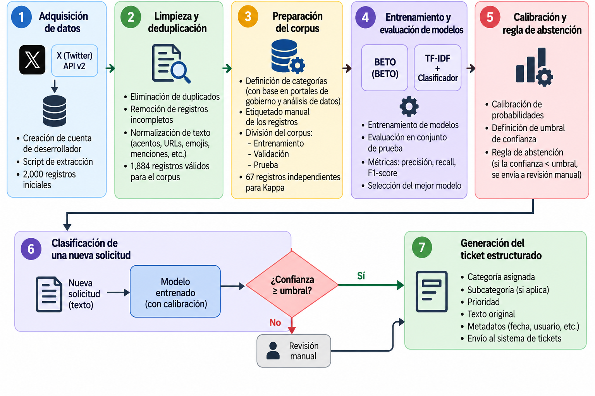
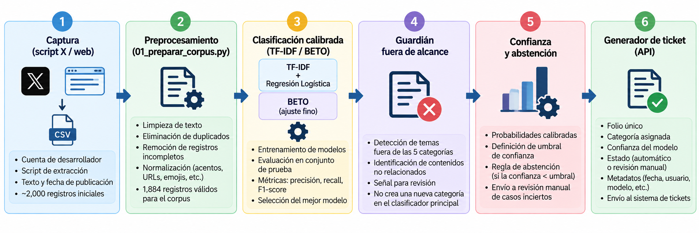
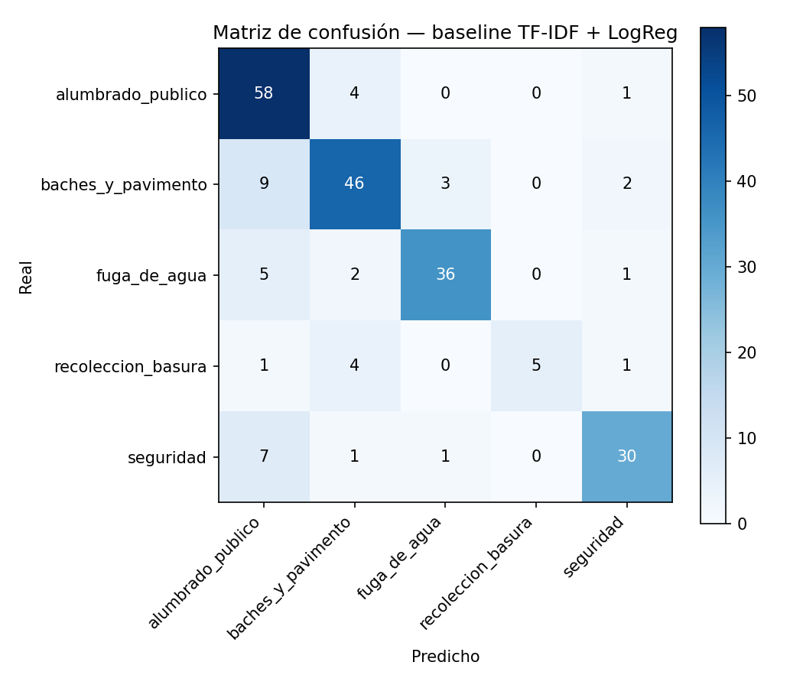

# Clasificador-de-solicitudes-ciudadanas-en-espa-ol

Prototipo de clasificación multiclase de solicitudes ciudadanas en español, con generación automática de tickets, desarrollado para la Ciudad de México (CDMX). Proyecto académico — UNIR, Maestría en Inteligencia Artificial.

> **Modelo adoptado:** BETO (fine-tuning) — F1 macro **0.919** sobre 282 solicitudes reales de prueba, frente a **0.872** del baseline TF-IDF + regresión logística.

## Tabla de contenido

- [Descripción](#descripción)
- [Documentos fuente](#documentos-fuente)
- [Arquitectura](#arquitectura)
- [Resultados](#resultados)
- [Capturas de pantalla](#capturas-de-pantalla)
- [Cómo ejecutar el proyecto localmente](#cómo-ejecutar-el-proyecto-localmente)
- [Deploy en producción](#deploy-en-producción)
- [Estructura del repositorio](#estructura-del-repositorio)
- [Limitaciones y trabajo pendiente](#limitaciones-y-trabajo-pendiente)

## Descripción

El proyecto clasifica solicitudes ciudadanas de texto libre (reportes hechos en redes sociales y canales de atención de CDMX) en cinco categorías de servicio:

- 🕳️ Baches y pavimento
- 💡 Alumbrado público
- 🚰 Fuga de agua
- 🗑️ Recolección de basura
- 🚨 Seguridad

A partir de la categoría predicha y su nivel de confianza, el sistema genera automáticamente un **ticket estructurado** (folio, categoría, confianza, estado de revisión, metadatos) listo para integrarse a un sistema de atención ciudadana, aplicando una regla de abstención que envía a revisión humana los casos de baja confianza o fuera de alcance.

Se compararon dos enfoques de modelado sobre el mismo corpus y la misma partición de prueba:

| Enfoque | Descripción |
|---|---|
| **Baseline** | TF-IDF (1–2 gramas) + regresión logística con `class_weight` balanceado y calibración sigmoide |
| **BETO** | Fine-tuning de [`dccuchile/bert-base-spanish-wwm-cased`](https://huggingface.co/dccuchile/bert-base-spanish-wwm-cased) con pérdida ponderada por clase y calibración por temperatura (entrenado en Google Colab con GPU) |

El corpus final se construyó a partir de reportes reales publicados en X (Twitter) hacia dependencias de CDMX, complementados con registros de LOCATEL y de Puebla, tras un proceso de deduplicación, filtrado y etiquetado (automático por reglas + revisión manual).

## Documentos fuente

### Documentación del proyecto

| Documento | Contenido |
|---|---|
| `PLAN_IMPLEMENTACION.md` | Diagnóstico inicial de los datos disponibles, estrategia de entorno (local vs. Google Colab) y plan de trabajo por fases/sprints. |
| `INSTALACION.md` | Guía de instalación paso a paso, solución al error `ModuleNotFoundError: sklearn.frozen` y tabla de dependencias por componente. |
| `GUIA_ANOTACION.md` | Guía de anotación manual: definición de las 5 categorías, casos límite y protocolo para el cálculo del Kappa de Cohen entre anotadores. |
| `BORRADOR_RESULTADOS.md` | Capítulo de resultados: construcción del corpus, comparación de modelos, calibración/abstención, análisis de errores y conclusiones. |
| `Proyecto_Clasificador...docx` | Documento formal de la memoria del proyecto (entrega UNIR). |
| `README Exportador de Posts.txt` | Documentación del userscript usado para la recolección de datos desde X (Twitter). |

### Datos de origen del corpus

| Archivo / carpeta | Contenido |
|---|---|
| `CORPUS/corpus_completo.csv` | Corpus consolidado y etiquetado (id, texto, categoría, método de etiquetado, entidad, alcaldía, fecha, fuente). |
| `CORPUS/train.csv`, `val.csv`, `test.csv` | Partición del corpus por grupos de plantilla (sin fuga de información entre conjuntos). |
| `CORPUS/excluidos_fuera_alcance.csv` | Textos fuera de las 5 categorías, usados para entrenar el detector auxiliar ("guardián"). |
| `CORPUS/muestra_control_anotacion.csv` | Muestra de control para el cálculo del acuerdo entre anotadores (Kappa de Cohen). |
| `CORPUS/reporte_corpus.txt` | Reporte automático de construcción: conteos, deduplicación y distribución de clases. |
| `Registros_LOCATEL_codificacion_kappa_anotador.xlsx` | Registros de LOCATEL incorporados al corpus y hoja de codificación de anotadores. |
| `x_exportador_posts_comentado.js` | Userscript de recolección de publicaciones desde X (Twitter). |

## Arquitectura

### Pipeline de datos y modelado



### Arquitectura de la aplicación (flujo de una solicitud)



> Verifica que el nombre de este archivo coincida exactamente con el que subas al repositorio; en el ZIP original llegó con un problema de codificación en la letra "ó".

### Componentes y scripts

| Etapa | Script / archivo | Función |
|---|---|---|
| Adquisición de datos | `x_exportador_posts_comentado.js` | Userscript que extrae publicaciones de X (Twitter) hacia CSV/TXT |
| Preparación del corpus | `01_preparar_corpus.py` | Unifica fuentes, corrige codificación, deduplica (exacto + plantillas), etiqueta por reglas entidad+palabras clave y genera la partición train/val/test |
| Modelo base | `02_baseline_tfidf.py` | Entrena TF-IDF + regresión logística, calibra, evalúa y genera un ticket de ejemplo |
| Fine-tuning BETO | `03_beto_colab.ipynb` | Ajuste fino de BETO en Google Colab (GPU) con calibración por temperatura |
| Comparación de modelos | `03_comparar_modelos.py` | Compara baseline vs. BETO sobre el mismo conjunto de prueba y aplica el criterio de decisión del proyecto |
| Acuerdo entre anotadores | `04_kappa_anotacion.py` | Calcula el Kappa de Cohen sobre la muestra de control |
| API + interfaz web | `07_api.py` | Sirve el modelo vía FastAPI (`/clasificar`, `/salud`) y una interfaz web de captura/resultado en la raíz |

**Stack principal:** Python · scikit-learn · pandas · FastAPI · Transformers/BETO (Colab) · joblib · matplotlib.

## Resultados

Comparación sobre el mismo conjunto de prueba (n = 282 solicitudes reales):

| Métrica | TF-IDF + LogReg | BETO |
|---|---|---|
| Accuracy | 0.872 | **0.915** |
| F1 macro | 0.872 | **0.919** |
| Cobertura automática (umbral 0.60) | 84.4% | 99.3% |
| F1 macro en casos emitidos | 0.922 | 0.921 |
| Errores totales | 36 | **24** |

Con el corpus final (1,884 solicitudes reales, 5 categorías balanceadas entre 14% y 27%), **BETO fue adoptado como modelo del prototipo**: mejora el F1 macro en +0.047 y reduce los errores absolutos en un tercio, con las cinco categorías por encima de 0.88 de F1. El baseline se conserva como alternativa reproducible sin GPU, ya que también supera el criterio de éxito del proyecto (F1 macro ≥ 0.80).

Tiempo técnico de generación de un ticket (baseline, sin GPU): mediana 1.3 ms (p95 1.4 ms).

## Capturas de pantalla

Matriz de confusión del modelo baseline sobre el conjunto de prueba:



> Agrega aquí una captura de la interfaz web (disponible en `http://127.0.0.1:8000` al ejecutar `07_api.py`) y de la documentación Swagger en `/docs`.

## Cómo ejecutar el proyecto localmente

Requiere **Python 3.10 o superior**.

```bash
# 1. Dentro de la carpeta del proyecto, crear un ambiente virtual
python3 -m venv .venv

# 2. Activar el ambiente
source .venv/bin/activate          # macOS / Linux
# .venv\Scripts\activate           # Windows (PowerShell o CMD)

# 3. Instalar las dependencias exactas
pip install -r requirements.txt

# 4. Levantar la API + interfaz web
python3 07_api.py
```

- Interfaz web: `http://127.0.0.1:8000`
- Documentación interactiva (Swagger): `http://127.0.0.1:8000/docs`
- Endpoints: `GET /salud` (estado del servicio) y `POST /clasificar` (recibe `{"texto": "..."}` y devuelve un ticket estructurado)

Para reproducir el pipeline completo desde cero:

```bash
python3 01_preparar_corpus.py      # genera CORPUS/
python3 02_baseline_tfidf.py       # entrena y evalúa el baseline, genera RESULTADOS/
# En Google Colab: ejecutar 03_beto_colab.ipynb con CORPUS/train.csv, val.csv y test.csv,
# descargar predicciones_test_beto.csv y guardarlo en RESULTADOS/
python3 03_comparar_modelos.py     # compara baseline vs. BETO
```

### Error conocido: `ModuleNotFoundError: No module named 'sklearn.frozen'`

Indica que el ambiente tiene una versión de scikit-learn anterior a 1.6, incompatible con los modelos `.joblib` guardados. Solución preferida: instalar exactamente las versiones de `requirements.txt`. Alternativa: regenerar los modelos en tu propio ambiente ejecutando `01_preparar_corpus.py` y `02_baseline_tfidf.py` de nuevo (los `.joblib` no son portables entre versiones de scikit-learn, pero los CSV del corpus sí lo son).

## Deploy en producción

Este repositorio se entrega como **prototipo académico** y no incluye actualmente configuración de despliegue (no hay `Dockerfile` ni definición de infraestructura en el repositorio). Como referencia general para llevarlo a producción, un camino típico sería:

1. Empaquetar `07_api.py` y los modelos `.joblib` de `RESULTADOS/` en una imagen de contenedor (por ejemplo, con Docker), instalando las dependencias de `requirements.txt`.
2. Servir la aplicación con `uvicorn` detrás de un proceso administrado (Gunicorn + Uvicorn workers, o el propio Uvicorn con `--workers`).
3. Desplegar el contenedor en un proveedor de PaaS/contenedores (Render, Railway, Fly.io, Google Cloud Run, etc.) o en un servidor propio.
4. Si se sirve BETO en lugar del baseline, considerar el costo de inferencia en CPU (decenas de milisegundos por solicitud, según lo documentado) al dimensionar la infraestructura.

Antes de desplegar en un entorno real, se recomienda recalibrar el umbral de abstención (ver `BORRADOR_RESULTADOS.md`, sección de calibración) según la capacidad de revisión humana disponible.

## Estructura del repositorio

```
.
├── 01_preparar_corpus.py
├── 02_baseline_tfidf.py
├── 03_beto_colab.ipynb
├── 03_comparar_modelos.py
├── 04_kappa_anotacion.py
├── 07_api.py
├── x_exportador_posts_comentado.js
├── requirements.txt
├── CORPUS/
│   ├── corpus_completo.csv
│   ├── train.csv / val.csv / test.csv
│   ├── excluidos_fuera_alcance.csv
│   ├── muestra_control_anotacion.csv
│   └── reporte_corpus.txt
├── RESULTADOS/
│   ├── modelo_baseline.joblib
│   ├── modelo_guardian.joblib
│   ├── baseline_metricas.txt
│   ├── comparacion_final.txt
│   ├── analisis_errores.txt
│   ├── matriz_confusion.png
│   └── ticket_ejemplo.json
├── PLAN_IMPLEMENTACION.md
├── INSTALACION.md
├── GUIA_ANOTACION.md
├── BORRADOR_RESULTADOS.md
├── flujov2.png
└── arquitectura_aplicacion.png
```

## Limitaciones y trabajo pendiente

- El corpus proviene de X (Twitter) y de un conjunto acotado de dependencias de CDMX y Puebla; no cubre todos los canales de atención ciudadana.
- Parte del etiquetado es automático por reglas (validado solo parcialmente con revisión manual).
- El umbral de abstención (0.60 por defecto) requiere una decisión operativa institucional; el análisis de la curva cobertura/riesgo sugiere 0.90 como punto de operación más conservador para BETO.
- Pendiente metodológico: completar el cálculo del Kappa de Cohen entre los dos anotadores sobre `CORPUS/muestra_control_anotacion.csv` ejecutando `04_kappa_anotacion.py`.
